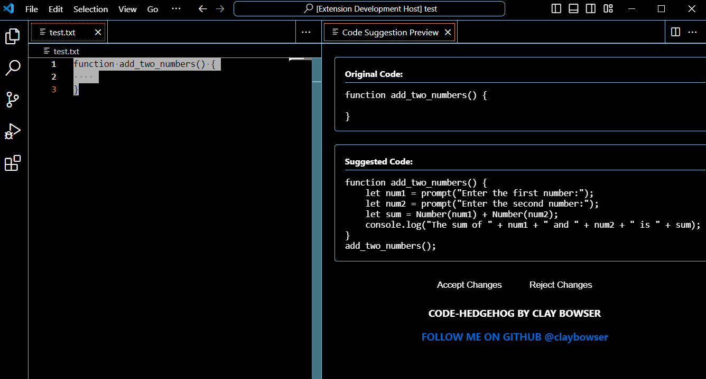

# Code Hedgehog by [Clay Bowser](https://github.com/claybowser)

Code Hedgehog is a VS Code extension that provides AI-powered code suggestions using Ollama and the CodeGemma model.

## Example Usage in VS Code:


## Prerequisites

Before using this extension, you need to:

1. Install [Ollama](https://ollama.ai/)
2. Pull and run the CodeGemma model using Ollama:
   ```bash
   ollama pull codegemma
   ```
3. Ensure Ollama is running locally with the CodeGemma model available at `localhost:11434`
    ```bash
    ollama run codegemma
    ```

## Features

- Get AI-powered code suggestions for selected code or current line
- Preview suggestions before applying them
- Accept or reject suggestions with a simple click

## Usage

1. Select the code you want to get suggestions for (or place your cursor on a line)
2. Open the Command Palette (Ctrl+Shift+P / Cmd+Shift+P)
3. Type "Get Code Suggestion" and select the command
4. Wait for the AI to generate a suggestion
5. Review the suggestion in the preview panel
6. Click "Accept" to apply the changes or "Reject" to cancel

## Notes

- Make sure Ollama is running before using the extension
- The extension requires an active internet connection to communicate with the local Ollama instance
- If you receive an error, check that:
  - Ollama is running
  - The CodeGemma model is installed
  - The server is accessible at `localhost:11434`

## Requirements

- VS Code 1.95.0 or higher
- Ollama installed and running locally
- CodeGemma model pulled and available in Ollama

## Extension Settings

This extension currently has no configurable settings.

## Known Issues

- None at this time

## Release Notes

### 0.0.1

Initial release of Code Hedgehog:
- Basic code suggestion functionality
- Preview system for suggestions
- Integration with Ollama and CodeGemma

## Contributing

Feel free to open issues or submit pull requests on the [repository](https://github.com/claybowser).

## License

This project is licensed under the MIT License.
